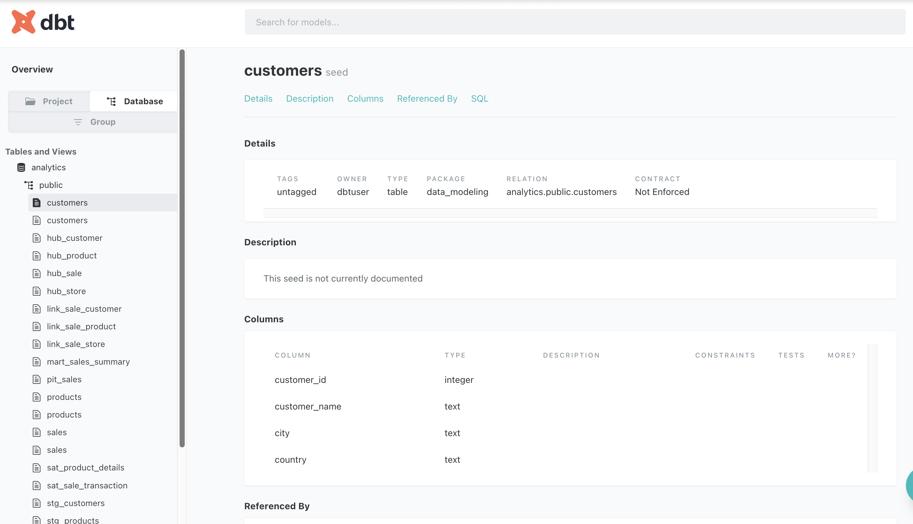
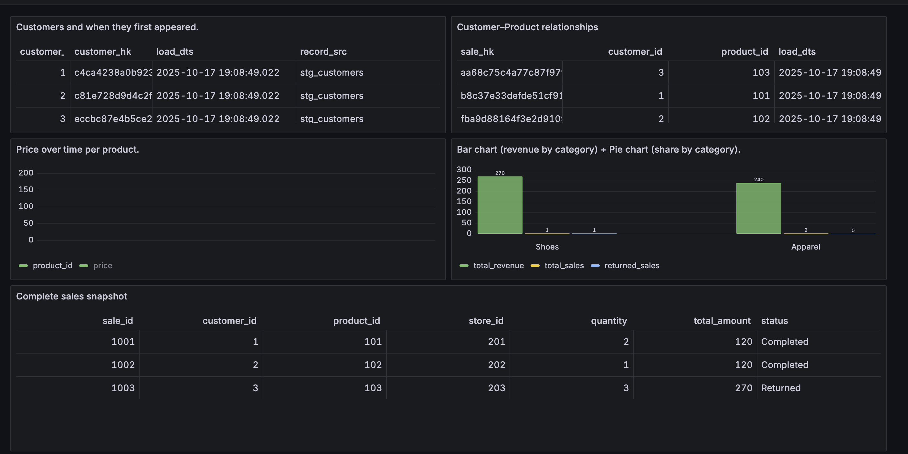

#  Fashion Data Vault with dbt + Postgres + Grafana

This project demonstrates **Data Vault 2.0 modeling** using the **Fashion Retail domain** (Customers, Products, Stores, Sales).  
It is dockerized with **Postgres, dbt, and Grafana** for easy setup and exploration.  
The goal is to both **learn Data Vault concepts** and **see them in action with BI dashboards**.

---

##  What is Data Vault?

**Data Vault 2.0** is a data modeling methodology designed for:
- **Agility** : easily adapt to new data sources or changes
- **Auditability** : full traceability with record source + load timestamp
- **History** : never overwrite; always capture historical context

Core building blocks:
- **Hubs** : unique business keys (Customer, Product, Sale, Store)  
- **Links** : relationships between hubs (Sale <-> Customer, Sale <-> Product, Sale <-> Store)  
- **Satellites** : descriptive attributes and history (price, status, quantity)  
- **PIT** : Point-in-Time tables that join hubs, links, and satellites into usable snapshots  
- **Marts** : business-friendly stars/KPIs for BI tools  

---

##  Simple Example

### Business Event
 Alice buys  2 Blue Jeans from  Berlin Store.

### How Data Vault Stores It
- **Hub Customer** : Alice (`customer_id=1`)  
- **Hub Product** : Blue Jeans (`product_id=101`)  
- **Hub Store** : Berlin Store (`store_id=201`)  
- **Hub Sale** : Sale #1001  

- **Link Sale-Customer** : Sale #1001 ↔ Alice  
- **Link Sale-Product** : Sale #1001 ↔ Blue Jeans  
- **Link Sale-Store** : Sale #1001 ↔ Berlin Store  

- **Sat Sale Transaction** : Sale #1001 had `qty=2, total=120, status=Completed`  
- **Sat Product Details** : Blue Jeans = `Apparel, price=60`  

- **PIT Sales** : Combines hubs, links, and satellites into one row:  


Sale 1001 | Alice | Blue Jeans | Berlin | qty=2 | total=120 | Completed


- **Mart Sales Summary** : Groups by category for BI:  
Apparel : Total Revenue = 240


---

## Comparison: Kimball vs Data Vault vs Data Lake vs Lakehouse

| Aspect | **Kimball (Star Schema)** | **Data Vault** | **Data Lake** | **Lakehouse** |
|--------|----------------------------|----------------|----------------|----------------|
| **Purpose** | BI reporting | Integration + audit + historization | Raw storage (cheap, unstructured) | Unified BI + ML |
| **Structure** | Facts + Dims | Hubs, Links, Satellites, PIT, Marts | Files in object store | Tables on object store (ACID) |
| **History** | SCD Type 2 (manual) | Satellites (built-in) | Often none | Time Travel (snapshots) |
| **Change Flexibility** | Medium (schema changes required) | High (add satellites/links easily) | Very high (just drop new files) | High (schema evolution supported) |
| **Auditability** | Weak | Strong (record_src + load_dts) | Weak | Strong (transaction logs) |
| **Best For** | Stable KPIs, dashboards | Multi-source integration + compliance | Raw dumps, cheap storage | BI + AI/ML workloads |

---

## How to Run This Project

### 1. Clone the repo
```bash
git clone https://github.com/ankit-khare-2015/data-vault-modelling.git
cd data-vault-modelling
```

### 2. Start Docker

```bash
cd docker
docker compose up -d
```

This starts:

Postgres (database)

Adminer (DB UI at http://localhost:8080
)

dbt (container for running dbt commands)

Grafana (dashboards at http://localhost:3000
)

### 3. Dbt Execution

Run this to load them:

```bash
docker exec -it dbt bash
cd /usr/app
dbt seed
```

####  Transform Your Data
```bash
dbt run
```

####  Test Data Quality
```bash
dbt test
```

####  View Lineage & Docs
```bash
dbt docs generate
dbt docs serve

Console Output
>:/usr/app# dbt docs serve
14:31:36  Running with dbt=1.7.7
Serving docs at 8080
To access from your browser, navigate to: http://localhost:8080
```
> 

### 4. Explore in Grafana

Open http://localhost:3000
.

Import the sample dashboard JSON (see grafana/ folder).

    Panels included:

    Hubs (table of business keys)

    Links (Sankey diagram)

    Satellites (time series history)

    PIT (snapshot table)

    Marts (business KPIs like Revenue by Category)

> 